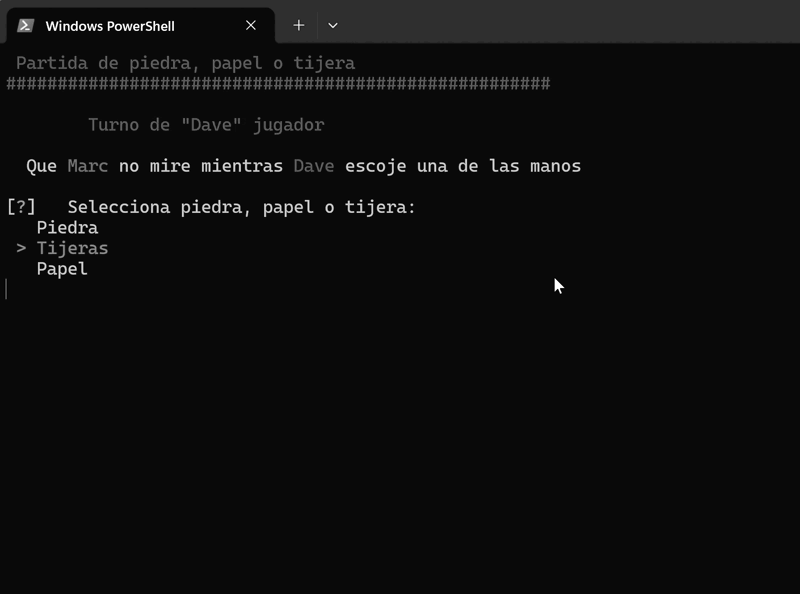

# Piedra, Papel o Tijera

Este es un juego de piedra, papel o tijera implementado en Python. Dos jugadores pueden jugar el juego en la misma computadora.



## Requisitos 

- Python 3.x
- Biblioteca `inquirer`

## Instalación

1. Clona este repositorio en tu máquina local.
2. Instala las dependencias necesarias ejecutando:
    ```bash
    pip install inquirer 
    ```

## Cómo jugar

1. Ejecuta el script `paperAndScissors.py`:
    ```bash
    python paperAndScissors.py
    ```
2. Sigue las instrucciones en pantalla para definir los jugadores y seleccionar sus colores.
3. Cada jugador tomará turnos para seleccionar piedra, papel o tijera.
4. El juego continuará hasta que uno de los jugadores gane dos rondas.
5. Al final del juego, se mostrará la pantalla de victoria final.

## Estructura del código

- `Player` class: Define un jugador con nombre, color y puntuación.
- `create_player(name, colour)`: Crea un nuevo jugador con el nombre y color dados.
- `get_colour_from_choice(choice)`: Devuelve el código de color basado en la elección.
- `get_hand_number_from_choice(choice)`: Convierte la elección de mano a un número correspondiente.
- `display_final_victory(player1, player2)`: Muestra la pantalla de victoria final.
- `play_game_round(player1, player2)`: Juega una ronda del juego.
- `main()`: Función principal para iniciar el juego.

## Contribuciones

Las contribuciones son bienvenidas. Por favor, abre un issue o un pull request para discutir cualquier cambio que te gustaría hacer.

## Licencia

Este proyecto está bajo la Licencia MIT. Consulta el archivo `LICENSE` para más detalles.